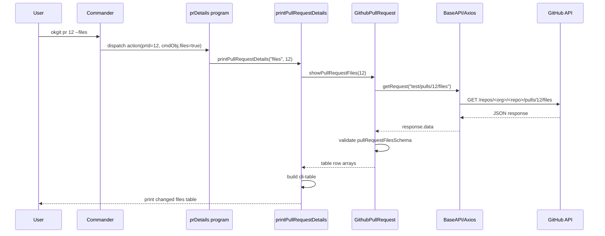

# okgit Architecture Notes

## 10,000 Foot Overview

`okgit` is a Node.js command-line tool for interacting with hosted Git services from a terminal. The published binary is `okgit`, and the current source implementation focuses primarily on GitHub operations, with early GitLab merge-request support. Bitbucket appears in product messaging and config choices, but no Bitbucket implementation exists in this repository yet.

The tool is organized as a layered CLI:

1. A small executable entrypoint loads the CLI command registry.
2. Commander command modules register individual commands and options.
3. Program modules either prompt the user with Inquirer or delegate directly to display/table helpers.
4. Table helpers call service API objects, transform rows into `cli-table` output, or print direct messages.
5. Service API classes call GitHub/GitLab REST endpoints through a shared Axios-based `BaseAPI`.
6. API responses are validated with Joi schemas before being converted into simple arrays for presentation.
7. Configuration is read from `~/.git-cli/config.json`; templates are stored beside it.

## Runtime Architecture

```mermaidbrew install --cask codexbrew install --cask codexbrew install --cask codexbrew install --cask codex
flowchart TD
    User[Terminal user] --> Bin[okgit binary]
    Bin --> Dist[dist/cli.js after build]
    Dist --> SourceCLI[lib/cli.js in source]

    SourceCLI --> Commander[commander singleton]
    Commander --> GHPrograms[GitHub program modules]
    Commander --> GLPrograms[GitLab program modules]
    Commander --> CommonPrograms[Common program modules]
    Commander --> ConfigPrograms[Config program modules]

    ConfigPrograms --> Inquirer[inquirer prompts]
    ConfigPrograms --> ConfigFiles[~/.git-cli/config.json and templates]

    GHPrograms --> Questionnaires[Questionnaire modules]
    Questionnaires --> Inquirer
    Questionnaires --> GitShell[git via shelljs]
    Questionnaires --> TemplateParser[GitHub template parser]
    TemplateParser --> ConfigFiles

    GHPrograms --> TableLayer[Table and print helpers]
    GLPrograms --> TableLayer
    CommonPrograms --> OpenLinks[open browser or print config]

    TableLayer --> GHFacade[GitHubAPI facade exports]
    TableLayer --> GLFacade[GitlabAPI facade exports]

    GHFacade --> GHPR[GithubPullRequest]
    GHFacade --> GHIssue[GithubIssue]
    GHFacade --> GHRepo[GithubRepo]
    GLFacade --> GLMR[GitlabMergeRequest]

    GHPR --> BaseAPI[BaseAPI]
    GHIssue --> BaseAPI
    GHRepo --> BaseAPI
    GLMR --> BaseAPI

    BaseAPI --> Axios[axios client]
    Axios --> GitHub[api.github.com]
    Axios --> GitLab[gitlab.com/api/v4]

    GHPR --> Schemas[Joi response schemas]
    GHIssue --> Schemas
    GHRepo --> Schemas
    GLMR --> Schemas
    Schemas --> RowData[plain table row arrays]
    RowData --> CliTable[cli-table output]
```

## Entry Points and Build

-   `okgit/okgit.js` is the source executable wrapper. It requires `../lib/cli.js`.
-   `lib/cli.js` imports every command-registration module, calls each registration function, then calls `program.parse(process.argv)`.
-   `package.json` exposes `"okgit": "./dist/cli.js"`, so consumers run compiled output rather than `lib/cli.js` directly.
-   `npm run build` deletes `dist` and compiles `lib` plus `okgit` with Babel 6 using `.babelrc`.
-   The source uses ES module syntax plus CommonJS `require`, transpiled by `babel-preset-latest` and `transform-runtime`.

## Command Surface

The CLI commands are registered as side effects against the shared Commander singleton:

| Area          | Commands                                                            | Main source                                            |
| ------------- | ------------------------------------------------------------------- | ------------------------------------------------------ |
| Config        | `config`, `switchrepo`, `showConfig`                                | `lib/programs/config`, `lib/programs/commons`          |
| Pull requests | `fetchPR`, `pr <id>`, `createPR`                                    | `lib/programs/services/github`                         |
| Issues        | `create-issue`, `issue <id>`, `list-issues`                         | `lib/programs/services/github`                         |
| Repositories  | `repo-details <repo>`, `create-repo`, `repo <repoName>`, `openRepo` | `lib/programs/services/github`, `lib/programs/commons` |
| GitLab        | `fetchMR <repo> <state>`                                            | `lib/programs/services/gitlab`                         |
| Version       | `-v`, `--version`                                                   | `lib/programs/commons/version.js`                      |

`pr <id>` is the richest command. It can show comments, commits, summary, files, update state, add/remove reviewers, merge, check out a PR locally, or open the PR in a browser.

## Configuration Model

`lib/configManager/parseConfig.js` is imported by most runtime modules. It reads `~/.git-cli/config.json` at module load time and exports:

-   `repo`
-   `org`
-   `token`
-   `hosting_provider`

When `process.env.IS_TESTING === "TRUE"`, the config manager bypasses the local file and exports fixed test values: `repo = "test"`, `org = "octo"`, `token = "123456"`.

Configuration is created through `okgit config`:

-   `lib/programs/questionnaire/cliConfig.js` asks for provider, access token, organization or username, repository, PR template, and issue template.
-   `lib/programs/config/createConfig.js` writes `config.json` and optional templates under `~/.git-cli/`.
-   `switchrepo` rewrites only the organization and repository in `config.json` using `shell.sed`.

Important implication: because config values are loaded at import time, changes to `~/.git-cli/config.json` affect the next command process, not already-instantiated API objects in the same process.

## Service Layer

### BaseAPI

`lib/api/BaseAPI.js` centralizes HTTP behavior:

-   Builds an Axios instance per request.
-   Sets `baseURL`, timeout, and `Authorization: token <token>` header.
-   Provides `getRequest`, `postRequest`, `patchRequest`, `deleteRequest`, and `putRequest`.
-   Converts Axios errors to rejected `err.response` objects so service methods can inspect `status`.

The auth header currently uses GitHub's token style for all providers. GitLab support may need provider-specific auth handling to be complete.

### Provider Facades

`lib/api/services/github/GitHubAPI.js` creates singleton service instances:

-   `GithubPR`
-   `GithubIssueAPI`
-   `GithubRepoAPI`

Each receives a base URL from `createAPIBaseURL(org, hosting_provider)`.

`lib/api/services/gitlab/GitlabAPI.js` similarly creates `GitlabMR`.

`lib/utils/helpers.js` maps provider names:

-   GitHub: `https://api.github.com/repos/<org>`
-   GitLab: `https://gitlab.com/api/v4`

### GitHub Pull Requests

`GithubPullRequest` owns PR API behavior:

-   Create pull request: `POST /<repo>/pulls`
-   List pull requests: `GET /<repoName>/pulls?state=<state>`
-   Get summary: `GET /<repo>/pulls/<id>`
-   Comments: `GET /<repo>/pulls/<id>/comments`
-   Commits: `GET <repo>/pulls/<id>/commits`
-   Files: `GET <repo>/pulls/<id>/files`
-   Update state: `PATCH /<repo>/pulls/<id>`
-   Add/remove reviewers: `POST` or `DELETE /<repo>/pulls/<id>/requested_reviewers`
-   Merge: `PUT /<repo>/pulls/<id>/merge`

Responses are reduced to row arrays for printing. Dates in PR lists are formatted with Moment's relative time.

### GitHub Issues

`GithubIssue` owns issue API behavior:

-   Create issue: `POST <repo>/issues`
-   Get issue: `GET /<repo>/issues/<id>`
-   List issues: `GET /<repo>/issues`
-   Update issue: `PATCH <repo>/issues/<id>`

Issue update supports three action names:

-   `label` -> `{ labels: data }`
-   `assign` -> `{ assignees: data }`
-   `close` -> `{ state: data }`

### GitHub Repositories

`GithubRepo` owns repository API behavior:

-   Details: `GET /<repoName>`
-   Create repository: `POST https://api.github.com/user/repos`
-   Star/unstar: `PUT` or `DELETE https://api.github.com/user/starred/<org>/<repoName>`
-   Enable vulnerability alerts: `PUT /<repoName>/vulnerability-alerts`

Repository table output includes full name, HTML URL, SSH URL, forks, open issues, stars, and subscribers.

### GitLab Merge Requests

`GitlabMergeRequest` supports listing merge requests:

1. Fetches user projects with `GET /users/<userName>/projects?simple=true`.
2. Finds the project with matching `name`.
3. Fetches merge requests with `GET /projects/<projectId>/merge_requests`.
4. Validates each merge request and returns rows with URL, state, author, and created date.

The requested `state` parameter defaults to `open` in code but is not currently appended to the GitLab API URL.

## Presentation Layer

The presentation layer is split into small table-specific modules under `lib/tables`.

-   Generic table creation/printing lives under `lib/tables/utils`.
-   Header constants live in `lib/tables/utils/pullRequestTableHeaders.js`.
-   Error messages are normalized in `lib/tables/utils/errorHandler.js`.
-   Feature-specific printers call API facades and push row arrays into tables.
-   Some commands print direct strings instead of tables, especially update operations.
-   Browser opening and local PR checkout are shell operations through `shelljs`.

The service layer already returns presentation-shaped row arrays, so the boundary between service and presentation is intentionally thin but not strictly separated.

## Data Validation

Responses are validated with Joi schemas under `lib/api/commons/schemas`.

Schema groups:

-   `issueSchema`
-   `pullRequestSchema`
-   `repositoriesSchema`
-   `mergeRequestSchema`

`validateSchema(response, schema)` returns a boolean. Service methods generally return empty arrays or empty strings when validation fails.

This gives the CLI defensive behavior against partial API responses, but invalid responses are silently dropped except for HTTP-level errors.

## Templates and Local Git

Pull request creation can use a saved PR template:

-   `githubTemplateParser("pullRequest")` reads `~/.git-cli/<repo>-pr-template.md` if present.
-   The parser processes the file through `remark` and `remark-github`.
-   `pullRequestQuestionnaire.js` uses the parsed template as the default editor value.

Local Git is used in two places:

-   Current branch detection: `git rev-parse --abbrev-ref HEAD`.
-   PR checkout: `git fetch origin pull/<id>/head:pr-<id>` followed by `git checkout pr-<id>`.

## Tests

The test stack is Mocha, Chai, Nock, Sinon, Proxyquire, and Nixt.

Current test organization:

-   `tests/unit/githubPullRequest.spec.js`
-   `tests/unit/githubIssue.spec.js`
-   `tests/unit/githubRepo.spec.js`
-   `tests/unit/helpers.spec.js`
-   `tests/unit/tableGenerator.spec.js`
-   `integration/githubPr.spec.js`
-   API mocks under `tests/unit/mocks/pull_requests`

`npm test` sets `IS_TESTING=TRUE`, excludes integration specs, registers Babel, and runs unit tests. Nock is used to assert HTTP behavior without reaching real GitHub.

## Code Structure

```text
okgit/
  okgit.js                         # source executable wrapper
lib/
  cli.js                           # command registration root
  constants.js                     # provider API base constants
  api/
    BaseAPI.js                     # Axios wrapper
    commons/
      validateSchema.js            # Joi validation helper
      schemas/                     # response schemas by domain
    services/
      github/
        GitHubAPI.js               # GitHub singleton facade
        issues/GithubIssue.js
        pull_requests/GithubPullRequest.js
        repos/GithubRepo.js
      gitlab/
        GitlabAPI.js               # GitLab singleton facade
        merge_requests/GitlabMergeRequest.js
  configManager/
    parseConfig.js                 # home-directory config loader
  parsers/
    githubTemplateParser.js        # saved markdown template reader
  programs/
    commons/                       # version, open repo, show config
    config/                        # create/switch config commands
    questionnaire/                 # inquirer prompts
    services/
      github/                      # GitHub command modules
      gitlab/                      # GitLab command modules
  tables/
    *.js                           # feature-specific print helpers
    utils/                         # table, header, and error utilities
tests/
  unit/                            # unit tests and mocks
integration/
  githubPr.spec.js                 # CLI integration test
assets/                            # README screenshots
scripts/                           # install/uninstall/test shell scripts
```

## Request Flow Example: `okgit pr 12 --files`



## Notable Design Characteristics

-   The app is a classic CLI shell around REST APIs: there is no long-lived server, database, job queue, or frontend runtime.
-   Most dependencies are CLI/runtime utilities: Commander, Inquirer, Axios, ShellJS, CLI Table, CLI Color, Joi, Moment.
-   API service classes inherit from the same base request wrapper, but provider-specific differences are not fully abstracted yet.
-   API classes are instantiated as singletons during module import, using configuration values available at that moment.
-   Service methods mix domain calls, validation, row shaping, and some direct console output.
-   Table helpers are the practical orchestration layer for many commands.
-   Tests mainly cover the API/service layer using mocked HTTP responses.

## Current Gaps and Risks

-   `parseConfig.js` requires `~/.git-cli/config.json` during import unless `IS_TESTING=TRUE`; commands that do not logically need config can still fail before parsing if the file is absent.
-   GitLab uses the same `Authorization: token ...` header as GitHub, which may not match GitLab's preferred token headers.
-   `fetchMR` accepts `state`, but the GitLab implementation does not send it to the API.
-   `repo <repoName> --enableScan` defines the option as `enableScan`, but checks `cmdObj["enable"]`; that path likely never runs.
-   `createRepoQuestionnaire.js` builds `has_wiki` from `repo_has_wiki`, but that prompt is not present.
-   Some aliases conflict: both `fetchPR` and `fetchMR` define alias `p`.
-   Several update methods print success based on requested input rather than validated API result.
-   `BaseAPI.putRequest` wraps the body as `{ data }`, which differs from the other request helpers and may not match all endpoint expectations.

## Mental Model for Future Changes

When adding a new command, the existing pattern is:

1. Add or extend a program module under `lib/programs/services/<provider>`.
2. Register it in `lib/cli.js`.
3. Add an Inquirer questionnaire if interactive input is needed.
4. Add or extend a provider service class under `lib/api/services`.
5. Add a Joi schema for response validation when consuming structured API data.
6. Add a table printer under `lib/tables` if the output is tabular.
7. Add Nock-backed unit tests for service behavior.

For larger provider work, the first architectural improvement would be to make authentication, base URL construction, and endpoint conventions provider-specific instead of relying on the GitHub-oriented `BaseAPI` defaults.
