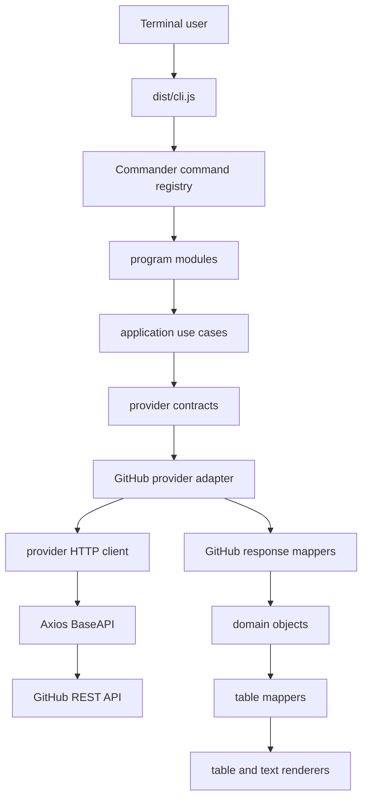

# okgit Architecture

`okgit` is a TypeScript CLI for working with hosted Git providers from the terminal. The current provider-first path supports GitHub. GitLab has a legacy merge-request list command, and Bitbucket is not implemented yet.

The intended runtime flow is:

```text
CLI command -> program module -> use case -> provider contract -> provider adapter -> mapper -> domain object -> table mapper -> renderer
```

This document explains the architecture contributors should follow when changing existing commands or adding new provider behavior.

## Runtime Flow



Some legacy paths still call API facades or table helpers directly. Prefer the provider-first path for new work, and keep legacy exports only for backward compatibility.

## Key Directories

| Path                         | Purpose                                                                                  |
| ---------------------------- | ---------------------------------------------------------------------------------------- |
| `lib/cli.ts`                 | Registers all Commander commands.                                                        |
| `lib/programs`               | Command modules and interactive questionnaires.                                          |
| `lib/application/usecases`   | Thin application layer between CLI programs and providers.                               |
| `lib/providers/contracts.ts` | Provider-facing domain contracts for PRs, issues, and repositories.                      |
| `lib/providers/github`       | GitHub provider factory and GitHub response mappers.                                     |
| `lib/api`                    | HTTP client contracts, provider client factories, auth headers, and legacy API services. |
| `lib/config`                 | Explicit config store and config validation.                                             |
| `lib/configManager`          | Compatibility helpers for older config callers.                                          |
| `lib/tables`                 | Human-readable table/text rendering and table row mappers.                               |
| `lib/utils`                  | Validation and process helpers.                                                          |
| `tests/unit`                 | Unit and adapter tests.                                                                  |

## Providers

Provider contracts live in `lib/providers/contracts.ts`. They return typed domain objects such as `PullRequestSummary`, `IssueDetails`, and `RepositoryDetails`, not table rows.

GitHub is currently wired through `createGithubProvider(config)` in `lib/providers/github/provider.ts`. The provider constructs one provider-specific `HttpClient` and passes it into the GitHub adapters:

-   `GithubPullRequest.fromHttpClient`
-   `GithubIssue.fromHttpClient`
-   `GithubRepo.fromHttpClient`

This makes adapters testable with fake HTTP clients and keeps provider-specific auth/base URL handling outside domain logic.

Unsupported providers should fail explicitly with `UnsupportedProviderError`. Do not silently fall back to GitHub for configured GitLab or Bitbucket provider names.

## HTTP and Auth

The shared HTTP contract is `HttpClient` in `lib/api/httpClient.ts`.

Provider-specific factories live in `lib/api/providerHttpClients.ts`:

-   `createGitHubHttpClient(config)`
-   `createGitLabHttpClient(config)`

Auth headers are created in `lib/api/authHeaders.ts`. GitHub and GitLab use different header formats, so adapters should not construct auth headers themselves.

`BaseAPI` remains the Axios implementation and compatibility surface. Its older `getRequest`, `postRequest`, `patchRequest`, `putRequest`, and `deleteRequest` methods delegate to the cleaner `HttpClient` method names.

## Config

The preferred config API is `FileConfigStore` in `lib/config/ConfigStore.ts`.

It provides:

-   `readConfig()`
-   `writeConfig(config)`
-   `updateConfig(mutator)`

Config values are validated before use, local config files are written with restrictive permissions, and both the current `personal_access_token` key and legacy misspelled `personnel_access_token` key are supported.

`lib/configManager/parseConfig.ts` still exists as a legacy shim for older imports. Avoid adding new import-time config reads; pass config or a `ConfigStore` explicitly instead.

## Rendering

Providers should not print. They return typed values.

Rendering belongs in `lib/tables`:

-   Domain-to-row mapping lives in `lib/tables/mappers`.
-   Table creation and printing lives in `lib/tables/utils`.
-   User-facing command output lives in print helpers.

This keeps the CLI ready for future output modes, such as JSON, without changing provider adapters.

## Error Handling

Provider error helpers live in `lib/api/providerErrors.ts`.

Current adapters use `withLegacyProviderErrorHandling` to preserve existing CLI behavior while centralizing HTTP status extraction. Future cleanup should move user-facing error rendering out of adapters entirely and return typed provider errors to the application layer.

## Command Surface

Current commands include both older names and cleaner aliases where they exist.

| Area          | Commands                                                                                         |
| ------------- | ------------------------------------------------------------------------------------------------ |
| Config        | `config`, `switchrepo`, `showConfig`                                                             |
| Pull requests | `fetchPR <repo> [state]`, `pull-requests <repo> [state]`, `createPR`, `create-pr`, `pr <id>`     |
| Issues        | `create-issue`, `issue <id>`, `list-issues`, `issues`                                            |
| Repositories  | `repo-details <repo>`, `repository-details <repo>`, `create-repo`, `repo <repoName>`, `openRepo` |
| GitLab legacy | `fetchMR <repo> <state>`                                                                         |
| Version       | `-v`, `--version`                                                                                |

Keep these commands backward compatible unless there is a deliberate major-version migration plan.

## Testing Strategy

Use focused tests at the layer being changed:

-   Mapper tests use static API-like fixtures and verify domain objects.
-   Adapter tests use fake `HttpClient` implementations where possible.
-   HTTP client/auth tests verify base URLs and headers.
-   Nock tests remain useful for legacy Axios integration behavior.
-   Config tests should use temporary directories and avoid the real home directory.
-   CLI command tests should verify aliases and option behavior without requiring real network calls.

Standard checks:

```bash
npm run typecheck
npm test
npm run lint
npm run build
```

If local npm bin shims are unavailable, the equivalent direct commands are:

```bash
node node_modules/typescript/bin/tsc --project tsconfig.json --noEmit
env IS_TESTING=TRUE TS_NODE_TRANSPILE_ONLY=0 NO_COLOR= node node_modules/mocha/bin/mocha '--exclude=integration/*.spec.ts' --require ts-node/register 'tests/unit/*.spec.ts'
node node_modules/eslint/bin/eslint.js "{lib,okgit,tests,integration}/**/*.ts"
node node_modules/typescript/bin/tsc --project tsconfig.build.json
```

## Adding Provider Behavior

1. Add or extend the provider contract in `lib/providers/contracts.ts`.
2. Implement provider-specific response mappers in `lib/providers/<provider>/mappers`.
3. Add adapter methods that return domain objects, not table rows.
4. Use a provider-specific `HttpClient` factory for auth and base URL behavior.
5. Add fake-client adapter tests and mapper tests.
6. Add table mappers/renderers only after the domain behavior is covered.
7. Register the command through a program module and delegate to a use case.

## Known Legacy Areas

-   GitLab support is partial and does not yet follow the provider-first architecture.
-   Some command modules still call table helpers directly.
-   Some table helpers still import compatibility use-case exports.
-   `parseConfig.ts` still exports globals for legacy compatibility.
-   Dependency upgrades are intentionally separate because CLI behavior and transitive types may shift.
