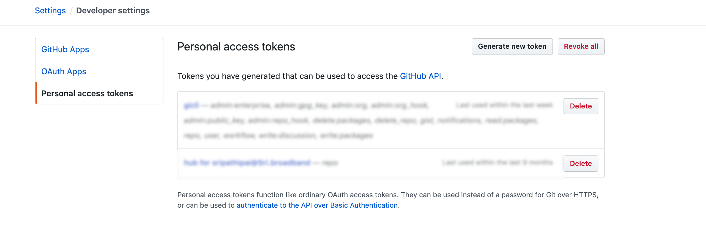
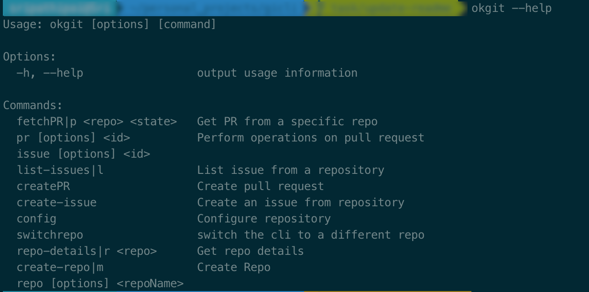
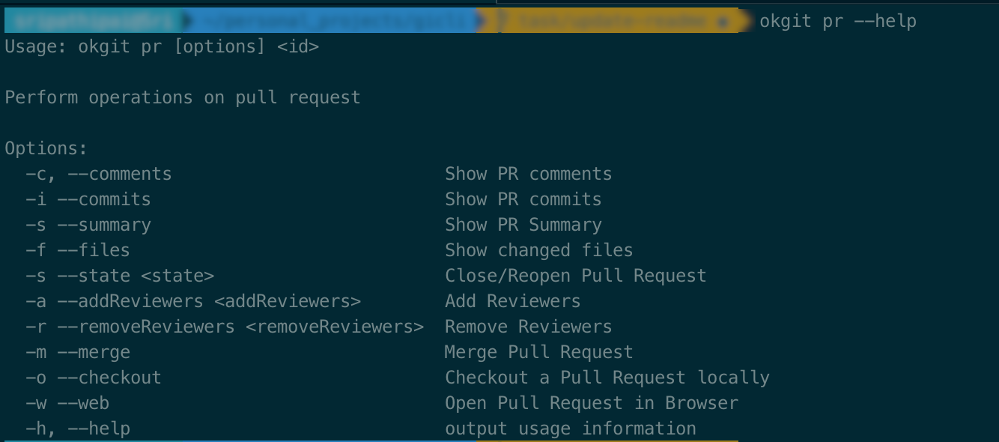

# okgit
A cli tool for interacting with Github(Gitlab,Bitbucket coming soon). The cli tool aims to speed up the dev productivity by allowing developers to interact with Github without having to leave their favorite commandline. The name is heavily inspired by voice assistant "Ok,Google".

## Installation
```
npm install okgit -g
```

## Configuration
okgit can be configured with one of the major cloud git providers
1. Github
2. Gitlab(Coming Soon)
3. Bitbucket(Coming Soon)

### Github
In order to configure `okgit` with [Github](https://github.com/) , first step would be to create a token
. Copy the token to a safe place(Please do not share the token with anyone else)

Now run `okgit config`
[okgit config](./assets/okgit-config.gif)


## Features
`okgit` allows us to interact with the following Github Features
# Pull Request
To view what ``okgit`` can do with pull requests just type 

````commandline
okgit --help
 
````


````commandline
okgit pr <id> --help
 
````


# Issue

 

