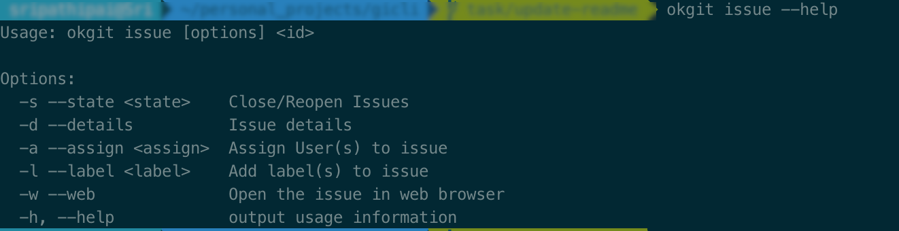
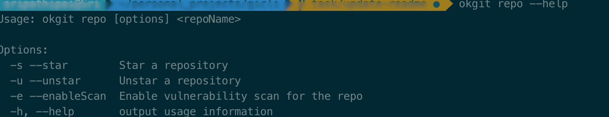

# okgit

 [](http://nodejs.org/download/) [](https://npmjs.org/package/okgit)

A cli tool for interacting with Github(Gitlab,Bitbucket coming soon). The cli tool aims to speed up the dev productivity by allowing developers to interact with Github without having to leave their favorite commandline. The name is heavily inspired by voice assistant "Ok,Google".

## Installation
```
npm install okgit -g
```
The above command installs `okgit`, globally . Couple more steps, hang in there .

## Configuration
I know, you are excited to get your hands dirty with `okgit`, we will now proceed to configure the tool.
okgit can be configured with one of the major cloud git providers
1. Github
2. Gitlab(Coming Soon)
3. Bitbucket(Coming Soon)

[](https://asciinema.org/a/8rsGr8p3LCGN7RlOVfMdroKOd)

### Github
In order to configure `okgit` with [Github](https://github.com/) , first step would be to create a token
. Copy the token to a safe place(Please do not share the token with anyone else)

Now run `okgit config`

## Features

[](https://asciinema.org/a/DTmeNPgxM75m7CriSxNhqPaxl)


## Features
`okgit` allows us to interact with the following Github Features
### Help
To view what ``okgit`` can do with pull requests just type 

````commandline
okgit --help
 
````

### PullRequest

````commandline
okgit pr <id> --help
 
````


### Issue

````commandline
okgit issue --help
 
````


### Repo

````commandline
okgit repo --help
 
````



### Running and building it locally
1. Clone the repository.
2. Install the dependencies using `npm install`.
3. Build the app using `npm build`.
4. Install the app locally using `npm install ./ -g`

