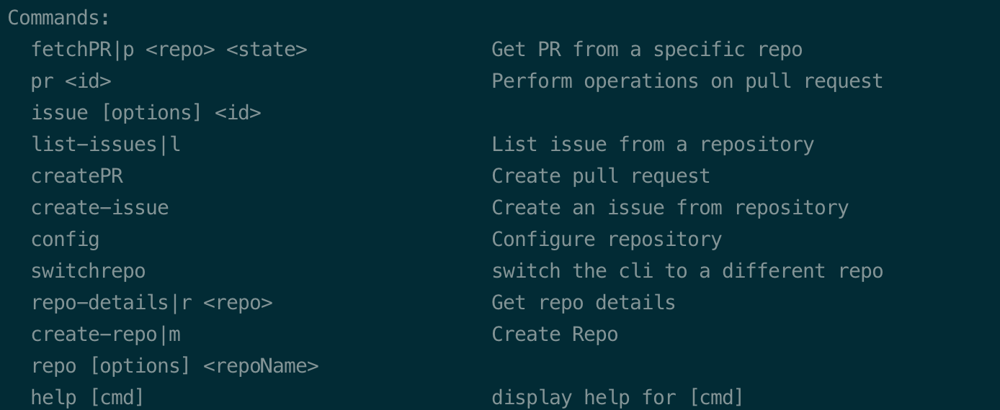
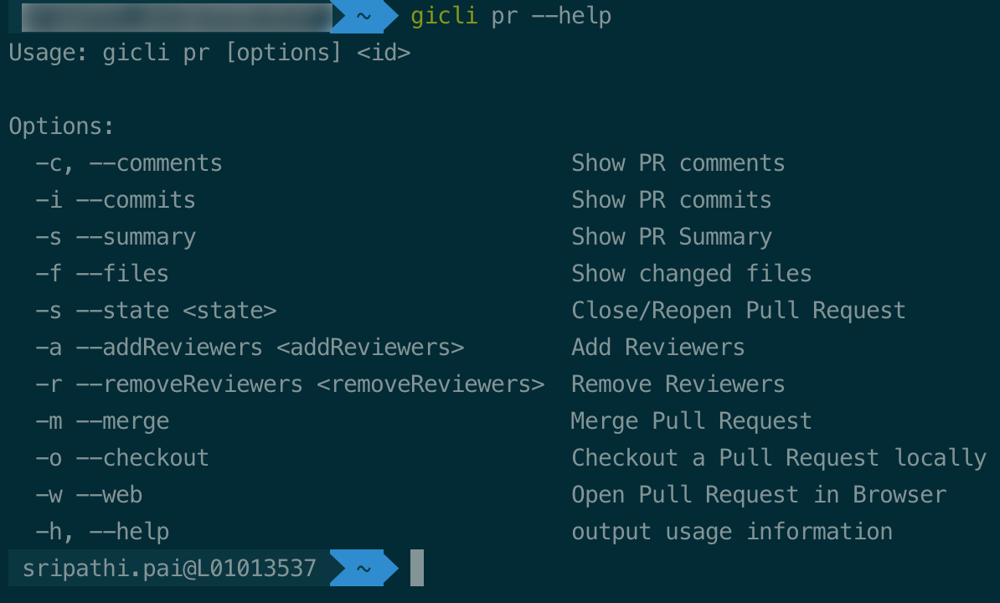

# gicli
A cli tool for interacting with Github. The cli tool aims to speed up the dev productivity by allowing developers to interact with Github without having to leave their 
favorite commandline.

## Features
Like all CLI , gicli encourages us
# Pull Request
To view what ``gicli`` can do with pull requests just type 

````commandline
gicli --help
 
````


````commandline
gicli pr <id> --help
 
````

 


 
# Installation
